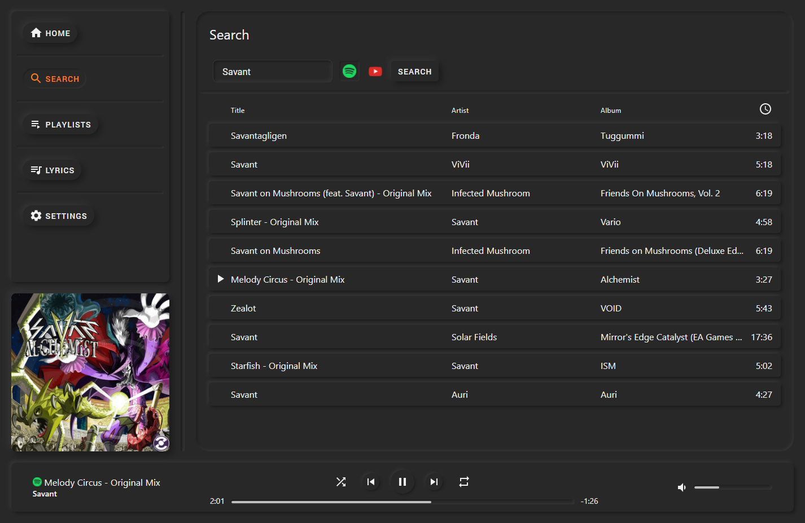
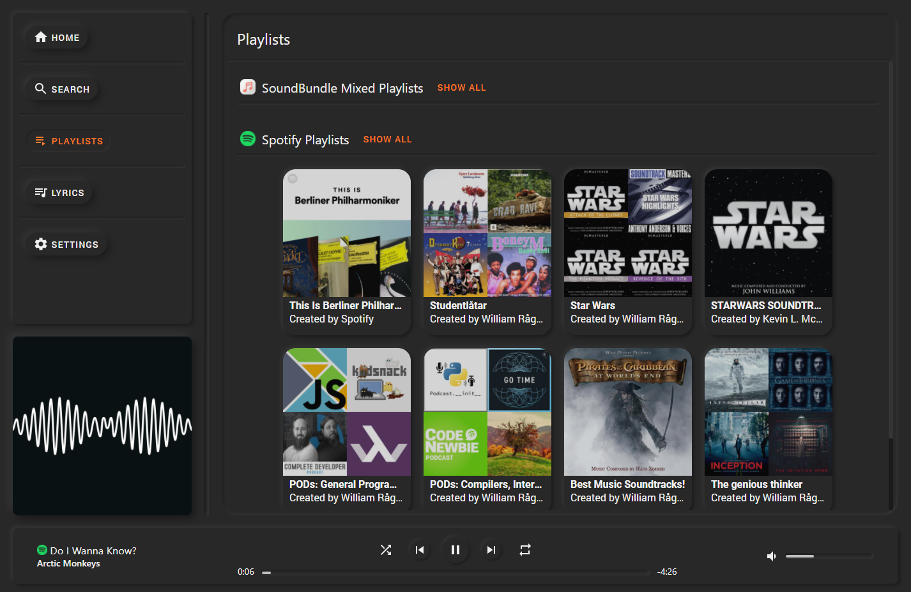
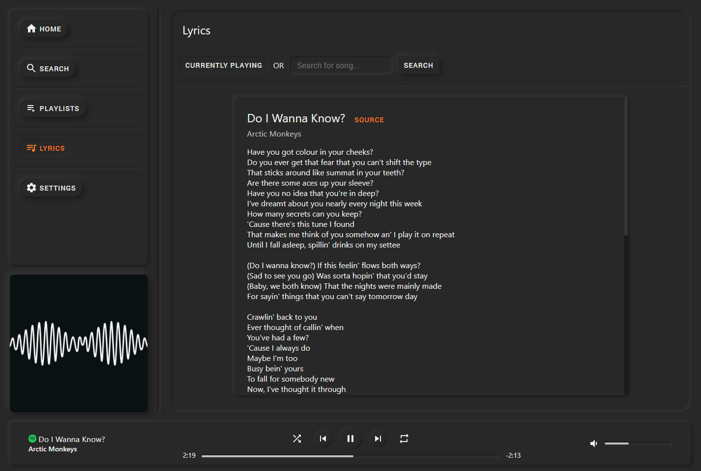
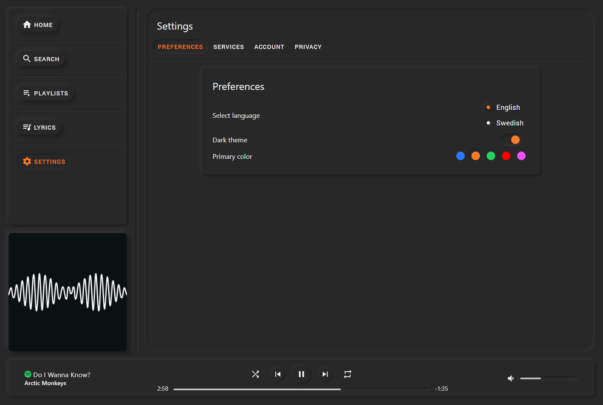
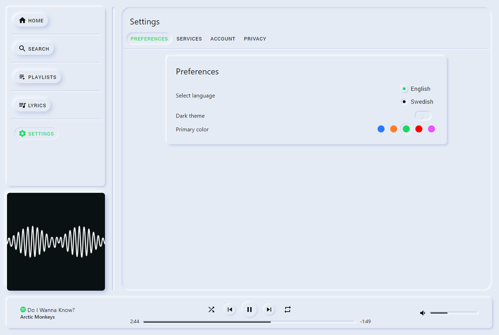

<div align="center">
    
    <h1>SoundBundle</h1>
    <p>A streaming platform for collecting music from various sources</p>
</div>


# About

SoundBundle is our **DH2642 HT20-1 Interaktionsprogrammering och dynamiska webben** project, which is an *neumorphic* web app providing a platform for searching and listening to music from various sources with full support for lyrics.

<span> Read more in our <a href="https://docs.google.com/document/d/1utB0_hyB3Sd4W2NWbWYI2HrTHzZCfNOXKaQLORdG7q4/edit?usp=sharing" target="_blank">project specification</a>.</span>


### TOC

* [About](#About)
* [Features](#Features)
* [Screenshots](#Screenshots)
* [Visit us!](#visit-us)
* [Developer Installation](#developer-installation)


## Features

- **Modern and minimalistic design**
- **High usability**
- Support for the **latest services**
- Robust **TypeScript** codebase

<span> Follow <a href="https://trello.com/b/CBiWqL12" target="_blank">our progress at Trello</a>.</span>

## Screenshots

### Search



### Playlists



### Lyrics



### Settings Dark



### Settings Light



---


## Visit us!

✨ We are hosted at https://soundbundle.herokuapp.com 🎉


## Developer Installation

This project was bootstrapped with [Create React App](https://github.com/facebook/create-react-app) and built using **React** and **Node.js** together with **TypeScript**.

```shell
npm install
npm start
"C:/Program Files (x86)/Google/Chrome/Application/chrome.exe" --disable-web-security --user-data-dir="C:/somedir"
```

The commands above runs the app in the development mode.
Open [http://localhost:3000](http://localhost:3000) to view it in the browser.

[🔺Back up!](#SoundBundle)